# Hi, I'm Abdulsalam Abdulrahman 👋

### Full-Stack Developer — Laravel · Flutter · PHP · JavaScript

I build **production-grade web and mobile applications** — from database and API design through to polished UI. I care about clean architecture, maintainable code, and solving real business problems end to end.

---

## 🧩 What I Do

- 🚀 **Full-Stack Web** — Laravel, PHP, Inertia.js, Svelte, Blade
- 📱 **Mobile** — Flutter (iOS & Android)
- 🛠️ **Backend & APIs** — REST APIs, database design, payment & third-party integrations
- 🏢 **Enterprise Systems** — multi-role workflows, ERP / HRIS / CMS-style platforms
- 🌐 **DevOps & Deployment** — VPS, Docker, Dokploy, Nixpacks, GitHub Actions

---

## 💼 Selected Work

> My strongest work lives in private / client repositories. Here's a sample, described by scope and impact rather than links.

**⚡ Electricity Utility Metering & Payments Platform**
Laravel + MySQL platform for a power-distribution utility — new-service applications, multi-role approval workflows (field → metering → supervisor → admin), meter assignment and installation tracking, and a live payment-gateway integration with automated settlement reconciliation. Running in production, serving real customers.

**🎓 Institute & Learning Platform**
Laravel + Inertia + Svelte 5 — public marketing site, student portal, and an admin CMS managing courses, content, and enrolments behind a single codebase.

**🩺 Telehealth Consultation Platform**
PHP web platform connecting patients with practitioners for remote consultations — scheduling, session management, and records.

**🚸 Student Safety & Pickup Verification System**
Web dashboard + Flutter mobile app that verifies authorised guardians at student pickup, reducing manual checks and improving safety.

**📱 Mobile Applications (Flutter)**
A range of cross-platform apps spanning ride-sharing, food delivery, invoicing, and education.

<!--
  EDIT ME: Replace or reorder the entries above with your actual top private projects.
  Keep client names out — describe the DOMAIN (e.g. "a fintech client"), your ROLE,
  the STACK, and the IMPACT. That reads stronger than a repo link.
-->

---

## 🛠️ Tech Stack

**Languages**

**Frameworks & Libraries**

**Databases & DevOps**

---

## 📊 GitHub Stats

<!-- Cards generated daily by .github/workflows/github-stats.yml (no Vercel rate limits) -->

---

## 🤝 Open to Work & Collaboration

I'm open to **full-stack and mobile roles**, **freelance projects**, and **open-source collaboration**.

<!-- Add these once you have the URLs:

-->

---

**Happy Coding! 🚀**

